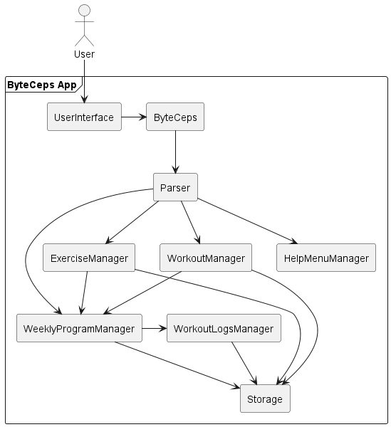
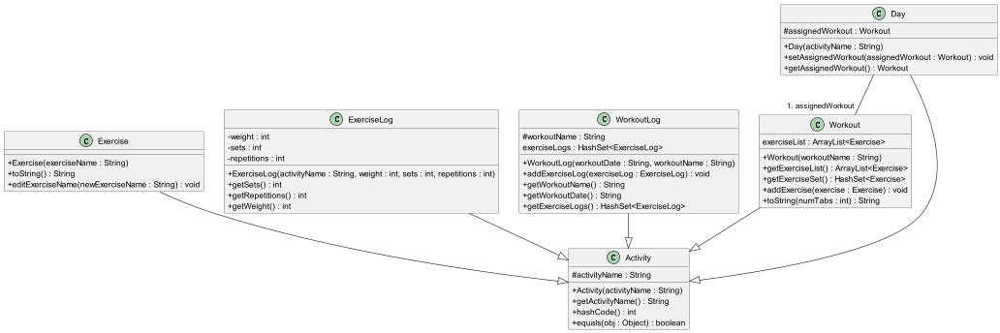
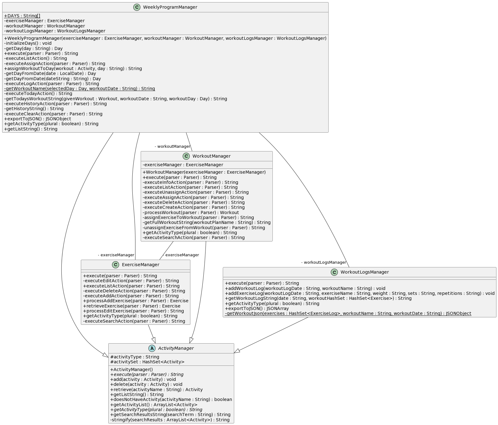
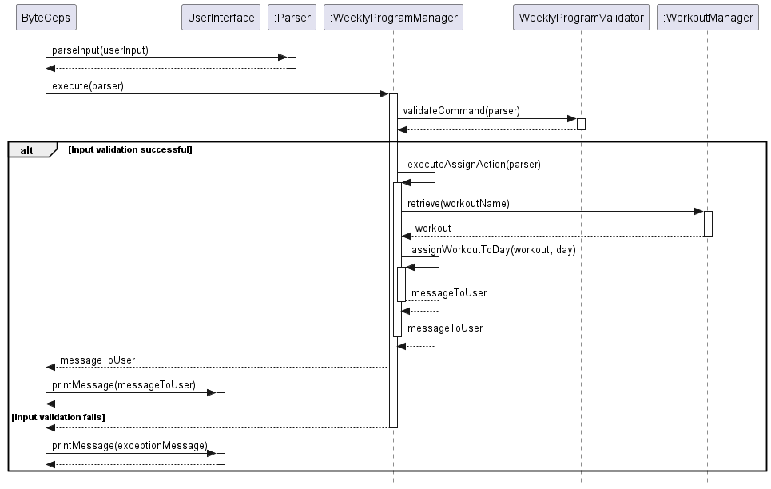
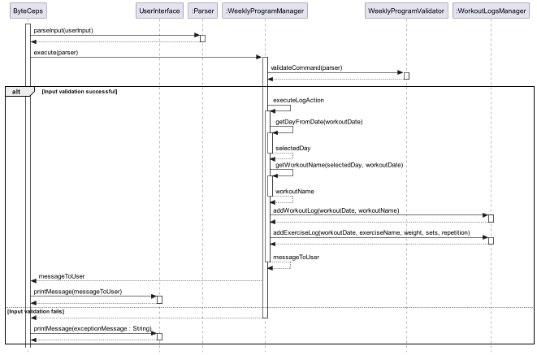
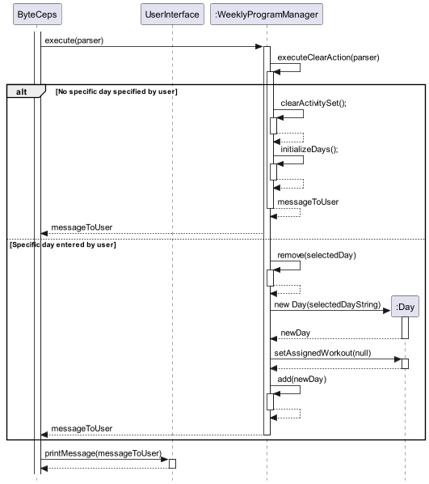

# Developer Guide

## Acknowledgements

[//]: # ({list here sources of all reused/adapted ideas, code, documentation, and third-party libraries -- include links to the original source as well})

1. [AB-3 Developer Guide](https://se-education.org/addressbook-level3/DeveloperGuide.html)
2. [PlantUML for sequence diagrams](https://plantuml.com/)

## Setting Up and Getting Started

First, fork [this repo](https://github.com/AY2324S2-CS2113-F14-3/tp), and clone the fork into your computer.

If you plan to use IntelliJ IDEA (highly recommended):

1. **Configure the JDK**: Follow the guide [se-edu/guides IDEA: Configuring the JDK](https://se-education.org/guides/tutorials/intellijJdk.html) to ensure IntelliJ is configured to use JDK 11.
2. **Import the project as a Gradle project**: Follow the guide
[se-edu/guides IDEA: Importing a Gradle project](https://se-education.org/guides/tutorials/intellijImportGradleProject.html)
to import the project into IDEA.

   :exclamation: **Note:** Importing a Gradle project is slightly different from importing a normal Java project.
3. **Verify the setup**:
   * Run `ByteCeps.java` and try a few commands.
   * Run the tests using `./gradlew check` and ensure they all pass.

---
## Design

This section provides a high-level explanation of the design and implementation of ByteCeps, 
supported by UML diagrams and short code snippets to illustrate the flow of data and interactions between the 
components.

---

### Architecture

Given below is a quick overview of main components and how they interact with each other.

## Design
### Architecture
Given below is a quick overview of the main components of ByteCeps and how they interact with each other.

**Main components of the architecture**

[ByteCeps](../src/main/java/byteceps/ByteCeps.java) is the entrypoint for the application to launch and shut down.

The bulk of ByteCep's work is done by the following components:
- [UserInterface](../src/main/java/byteceps/ui/UserInterface.java): Interacts with the user via the command line.
- [Parser](../src/main/java/byteceps/commands/Parser.java): Parses the user's input as saves their inputs in the class.
- [ExerciseManager](../src/main/java/byteceps/processing/ExerciseManager.java): Manages all the exercises stored in memory.
- [WorkoutManager](../src/main/java/byteceps/processing/WorkoutManager.java): Manages all the workouts in memory.
- [HelpMenuManager](../src/main/java/byteceps/processing/HelpMenuManager.java): Displays the help messages to the user.
- [WeeklyProgramManager](../src/main/java/byteceps/processing/WeeklyProgramManager.java): Manages the weekly program for the user in memory. 
- [WorkoutLogsManager](../src/main/java/byteceps/processing/WorkoutLogsManager.java): Managing the logging of workouts.
- [Storage](../src/main/java/byteceps/storage/Storage.java): Reads data from, and writes data to, the hard disk.

**Other notable components**:
- [Exercise](../src/main/java/byteceps/activities/Exercise.java): Stores an exercise entry by the user in memory.
- [Workout](../src/main/java/byteceps/activities/Workout.java): Stores a workout (collection of exercises) entry by the user in memory. 
- [ExerciseLog](../src/main/java/byteceps/activities/ExerciseLog.java): Stores an exercise log entry by the user in memory.
- [Exceptions](../src/main/java/byteceps/errors/Exceptions.java): Represents exceptions used by the components in the application.

## Classes: overview
### `Activity` and child classes
The `Activity` class serves as a parent class to `Exercise`, `ExerciseLog`, `Workout`, `WorkoutLog` and `Day` classes for the ease of usage of `ActivityManager` classes (see below).

**Note:** The `Day` class acts as a container class for `Workout`, for use in `WeeklyProgramManager` 

### <code>ActivityManager</code> and child classes
The <code>ActivityManager</code> and inheritors are responsible for managing an <code>ArrayList</code> of activities. The basic functions of an <code>ActivityManager</code> include:
1. <code>add()</code>: Adding an activity to the <code>ArrayList</code>
2. <code>delete()</code>: Deleting an activity from the <code>ArrayList</code>
3. <code>retrieve()</code>: Retrieving an activity from the <code>ArrayList</code> by name
4. <code>getListString()</code>: Get the string containing all the activities contained in the <code>ActivityManager</code>.
5. `execute()`: Execute all commands related to the `ActivityManager` and return the required user input.

#### The `ExerciseManager` class
`ExerciseManager` is responsible for tracking and manipulating all exercises added to `ByteCeps` by the user.

#### The `WorkoutManager` class
`WorkoutManager` is responsible for tracking and manipulating all workouts created by the user.

#### The `WeeklyProgramManager` class
`WeeklyProgram` is responsible for tracking and manipulating the weekly training program set by the user.

## Implementation
### Exercise Management
#### Add an Exercise
1. The process begins with the user inputting a command via the command-line interface. In this scenario, the user enters the command `exercise /add pushups`, indicating their intention to add a new exercise named `pushups` to the system.
2. The command parser receives the user input and parses it to extract relevant information, such as the action (`exercise /add`) and any additional parameters (e.g., the name of the exercise to be added).
3. Upon receiving the parsed command, the Exercise Manager component validates the input to ensure it conforms to the expected format and criteria. This step is crucial for maintaining data integrity and preventing errors in subsequent processing.
4. If the input passes validation, the Exercise Manager proceeds to create a new Exercise object with the specified name, `pushups`. It then invokes the add method within the Activity Manager component to add the newly created Exercise to the activity set. Finally, a success message confirming the addition of the exercise is printed to the user interface, indicating that the operation was completed successfully.
5. If the input fails validation, an error message is generated and displayed to the user, informing them of the invalid command format. This ensures that users receive timely feedback and can correct their input accordingly

The sequence diagram below shows how an exercise is created.

#### Delete an Exercise
1. The process begins with the user inputting a command via the command-line interface. In this scenario, the User provides the command `exercise /delete pushups` to delete the exercise named `pushups`.
2. The command parser receives the user input and parses it to extract relevant information, such as the action (`exercise /delete`) and any additional parameters (e.g., the name of the exercise to be deleted).
3. Upon receiving the parsed command, the Exercise Manager component validates the input to ensure it conforms to the expected format and criteria. This step is crucial for maintaining data integrity and preventing errors in subsequent processing.
4. If the input passes validation, the ExerciseManager retrieves the Exercise object associated with the name `pushups`. It then instructs the ActivityManager to delete the Exercise from the activitySet. The ExerciseManager then informs the User of the successful deletion.
5. If the input fails validation, an error message is generated and displayed to the user, informing them of the invalid command format. This ensures that users receive timely feedback and can correct their input accordingly

The sequence diagram below shows how an exercise is deleted.

#### Edit an Exercise
1. The process begins with the user inputting a command via the command-line interface. In this scenario, the User provides the command `exercise /edit pushups /to pressups` to change the exercise named `pushups` to `pressups`.
2. The command parser receives the user input and parses it to extract relevant information, such as the action (`exercise /edit`) and any additional parameters (e.g., the name of the exercise to be changed and the new name).
3. Upon receiving the parsed command, the Exercise Manager component validates the input to ensure it conforms to the expected format and criteria. This step is crucial for maintaining data integrity and preventing errors in subsequent processing.
4. If the input passes validation, the ExerciseManager retrieves the Exercise object associated with the name `pushups`. It then calls the object's instance method editExerciseName() to change the String stored in its instance field activityName. The ExerciseManager then informs the User of the successful edit.
5. If the input fails validation, an error message is generated and displayed to the user, informing them of the invalid command format. This ensures that users receive timely feedback and can correct their input accordingly

The sequence diagram below shows how an exercise is edited.

#### List Exercises
1. The process begins with the user inputting a command via the command-line interface. In this scenario, the User provides the command `exercise /list` to list all exercises.
2. The command parser receives the user input and parses it to extract relevant information, such as the action (`exercise /list`) and any additional parameters.
3. Upon receiving the parsed command, the Exercise Manager component validates the input to ensure it conforms to the expected format and criteria. This step is crucial for maintaining data integrity and preventing errors in subsequent processing.
4. If the input passes validation, the ExerciseManager instructs the ActivityManager to list all exercises. The ActivityManager retrieves the list of exercises from the activitySet. The ActivityManager returns the exercise list to the ExerciseManager. The ExerciseManager prints the list of exercises to the User.
5. If the input fails validation, an error message is generated and displayed to the user, informing them of the invalid command format. This ensures that users receive timely feedback and can correct their input accordingly

The sequence diagram below shows how exercises can be listed

#### Search an Exercise
1. The process begins with the user inputting a command via the command-line interface. In this scenario, the User provides the command `exercise /search pushups` to search for exercises containing `pushups`.
2. The command parser receives the user input and parses it to extract relevant information, such as the action (`exercise /search`) and any additional parameters (e.g., the name of the exercise to be search).
3. Upon receiving the parsed command, the Exercise Manager component validates the input to ensure it conforms to the expected format and criteria. This step is crucial for maintaining data integrity and preventing errors in subsequent processing.
4. If the input passes validation, the ExerciseManager instructs the ActivityManager to search for exercises containing the specified term. The ActivityManager performs the search operation on the activitySet. The ActivityManager returns the search results to the ExerciseManager. The ExerciseManager prints the search results to the User.
5. If the input fails validation, an error message is generated and displayed to the user, informing them of the invalid command format. This ensures that users receive timely feedback and can correct their input accordingly

The sequence diagram below shows how an exercise can be searched.

### Workout Management
#### Add a workout plan
1. The process begins with the user inputting a command via the command-line interface. In this scenario, the user enters the command `workout /create push_day`, indicating their intention to create a new workout plan named `push_day` in the system.
2. The command parser receives the user input and parses it to extract relevant information, such as the action (`workout /create`) and any additional parameters (e.g., the name of the workout plan to be created).
3. Upon receiving the parsed command, the Workout Manager component validates the input to ensure it conforms to the expected format and criteria. This step is crucial for maintaining data integrity and preventing errors in subsequent processing.
4. If the input passes validation, the Workout Manager proceeds to create a new Workout object with the specified name, `push_day`. It then invokes the add method within the Activity Manager component to add the newly created Workout to the activity set. Finally, a success message confirming the creation of the workout plan is printed to the user interface, indicating that the operation was completed successfully.
6. If the input fails validation, an error message is generated and displayed to the user, informing them of the invalid command format. This ensures that users receive timely feedback and can correct their input accordingly.

The sequence diagram below shows how a workout can be added.

#### Delete a workout plan
1. The process begins with the user inputting a command via the command-line interface. In this scenario, the User provides the command `workout /delete push_day` to delete the workout named `push_day`.
2. The command parser receives the user input and parses it to extract relevant information, such as the action (`workout /delete`) and any additional parameters (e.g., the name of the workout to be deleted).
3. Upon receiving the parsed command, the Workout Manager component validates the input to ensure it conforms to the expected format and criteria. This step is crucial for maintaining data integrity and preventing errors in subsequent processing.
4. If the input passes validation, the Workout Manager retrieves the Workout object associated with the name `push_day`. It then instructs the Activity Manager to delete the Workout from the activitySet. The Workout Manager then informs the User of the successful deletion.
5. If the input fails validation, an error message is generated and displayed to the user, informing them of the invalid command format. This ensures that users receive timely feedback and can correct their input accordingly.
6. 
The sequence diagram below shows how a workout can be deleted.

#### List workout plan
1. The process begins with the user inputting a command via the command-line interface. In this scenario, the User provides the command `workout /list` to list all workouts.
2. The command parser receives the user input and parses it to extract relevant information, such as the action (`workout /list`).
3. Upon receiving the parsed command, the Workout Manager component validates the input to ensure it conforms to the expected format and criteria. This step is crucial for maintaining data integrity and preventing errors in subsequent processing.
4. If the input passes validation, the Workout Manager instructs the Activity Manager to retrieve the list of workouts from the activitySet. The Activity Manager retrieves the list of workouts from the activitySet. The Activity Manager formats the list of workouts using the `getListString` method. The Activity Manager returns the formatted list of workouts to the Workout Manager. The Workout Manager then presents the formatted list of workouts to the User.
5. If the input fails validation, an error message is generated and displayed to the user, informing them of the invalid command format. This ensures that users receive timely feedback and can correct their input accordingly.

The sequence diagram below shows how workout plans can be listed.

### Logging of workouts 
In order to log workouts, we have several layers to implement:
1. Logging of exercises
2. Storing logged exercises in a logged workout
3. Storing all logged workouts

The implementation for the above is as such:
1. `ExerciseLog` extends from the `Activity` class, and introduces `weight`, `set` and `repetitions` as variables to be stored.
2. `WorkoutLog` extends from the `Activity` class, and introduces `HashSet<ExerciseLog>` to store all logged exercises for that given workout, and `workoutName` to store the name of the `Workout` that was intended to be for that day. The id for this class is the date of the workout.
3. All `WorkoutLog` classes created are stored in `WorkoutLogsManager`, which is extended from `ActivityManager`. 

The user interfaces with this feature through the `WeeklyProgramManager`, as it is intended that the user logs their exercises according to the workout program that they have assigned to a specified day. 

The sequence diagram below shows how a log is created.

### Program management
#### Assigning a workout to a program
Below is the sequence diagram of the command `program /assign <workout> /to <day>` being run:

#### Logging an exercise
Below is the sequence diagram of the command `program /log <EXERCISE_NAME [string]> /weight
 <WEIGHT [integer]> /sets <NUMBER_OF_SETS [integer]> /reps <NUMBER_OF_REPS [integer]> /date <DATE [yyyy-mm-dd]> ` being run: 

#### Clearing a day in the program
This is the sequence diagram of the command `program /clear <day [optional]>` being run.
The validation of user input has been omitted for purposes of brevity.

## Product scope
### Target user profile

BYTE-CEPS, a CLI-based all-in-one tool for setting and tracking fitness goals. Whether you're a tech-savvy fitness enthusiast or just starting your fitness journey, BYTE-CEPS offers the simplicity and efficiency of a CLI interface to help you maintain or improve your fitness through self-managed routines.

### Value proposition

ByteCeps offers a streamlined and comprehensive platform to manage exercise routines, track workout progress, and design personalized fitness programs with ease and efficiency for fitness enthusiasts and professionals. 

1. Streamlined Exercise Management: ByteCeps simplifies the organization of exercise routines by providing a user-friendly interface to add, edit, delete, list and search exercises effortlessly.
2. Effortless Workout Planning: Create personalized workout plans by assigning exercises to specific days with intuitive CLI commands, ensuring organized and effective training sessions tailored to your needs.
3. Flexible Program Adaptation: Seamlessly adjust workout plans and schedules as needed with the ability to add, remove, or modify exercises on the fly, providing flexibility and adaptability to your evolving fitness journey.
4. Comprehensive Progress Tracking: Log and monitor workout performance, including weights, sets, and reps, with detailed exercise logs and historical data, enabling you to track progress, identify trends, and stay motivated.

With ByteCeps, achieve your fitness objectives efficiently, effectively, and enjoyably, unlocking your full potential for a healthier, fitter lifestyle.

## User Stories

| Version | As a ... | I want to ...             | So that I can ...                                           |
|---------|----------|---------------------------|-------------------------------------------------------------|
| v1.0    | user     | create an exercise entry             | begin tracking my exercises                      |
| v1.0    | user     | create edit an exercise entry        | modify an exercise to suit my needs              |
| v1.0    | user     | delete an exercise entry             | remove unwanted exercises that I will not do     |
| v1.0    | user     | add an exercise to a workout plan    | customise my workout plan                        |
| v1.0    | user     | edit an exercise in a workout plan   | modify the workout plan to suit my needs         |
| v1.0    | user     | delete an exercise from workout plan | remove unwanted exercises from a workout plan    |
| v1.0    | user     | list all exercises in a workout plan | see the details of my planned exercises          |
| v1.0    | user     | choose the workout plan for a day    | organise and structure my daily workout routine  |
| v1.0    | user     | display my workout for the day       | know what exercises I should be doing today      |
| v1.0    | user     | display my workout for the week      | have a weekly overview of what I should do       |
| v2.0    | user     | export my workout plan to Json       | share with other fitness enthusiasts             |
| v2.0    | user     | import my workout plan to Json       | bring my progress across devices                 |
| v2.0    | user     | search for exercises                 | build my workout plan faster                     |
| v2.0    | user     | search for workout plans             | identify which is the suitable workout for me    |
| v2.0    | fitness enthusiast   | record the amount of weight lifted                             | track my progress over time                                       |
| v2.0    | fitness enthusiast   | track the number of sets performed for each exercise session   | follow my workout plan effectively                                |
| v2.0    | fitness professional | monitor the repetitions completed for each exercise            | evaluate my clients' performance and provide tailored feedback    |
| v2.0    | fitness professional | log my exercise data for a specific date                       | accurately track my progress over time                            |
| v2.0    | fitness professional | view a list of dates on which I have logged exercise entries   | track my consistency and adherence to my workout routine          |
| v2.0    | fitness professional | review specific exercise logs for a particular date            | analyze my workout details and progress on that specific day      |

## Non-Functional Requirements

1. BYTE-CEPS should work on Windows, macOS and Linux that has Java 11 installed.
2. BYTE-CEPS should be able to store data locally.
3. BYTE-CEPS should be able to work offline.
4. BYTE-CEPS should be easy to use.

## Glossary

* *glossary item* - Definition

## Instructions for manual testing

{Give instructions on how to do a manual product testing e.g., how to load sample data to be used for testing}
