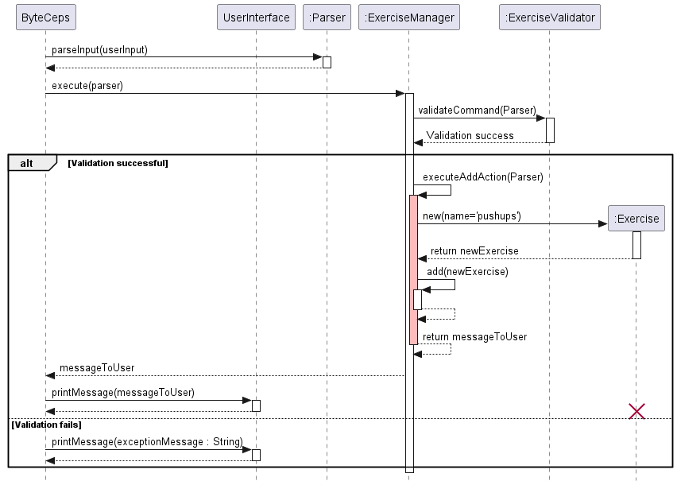
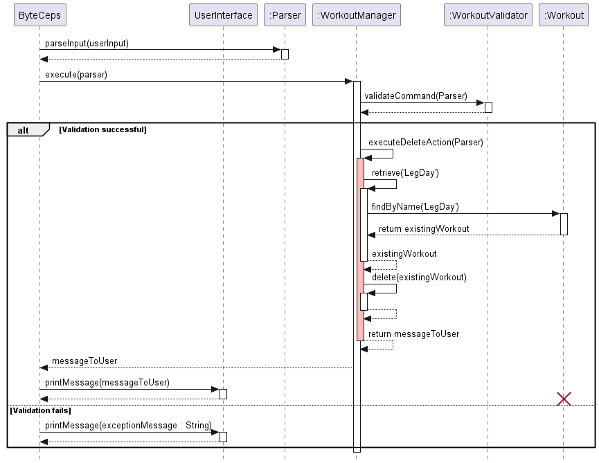
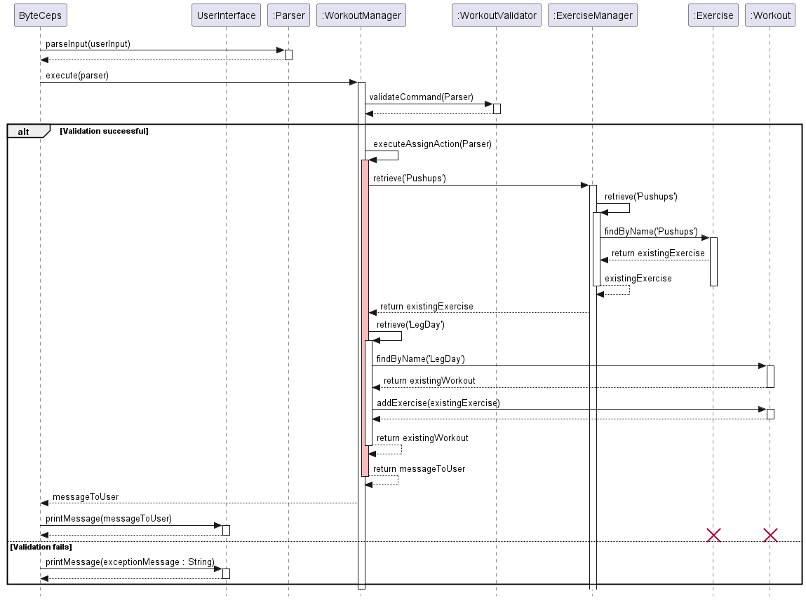
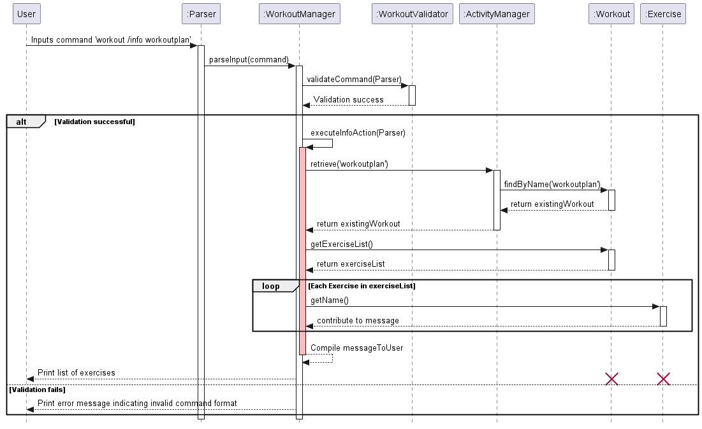
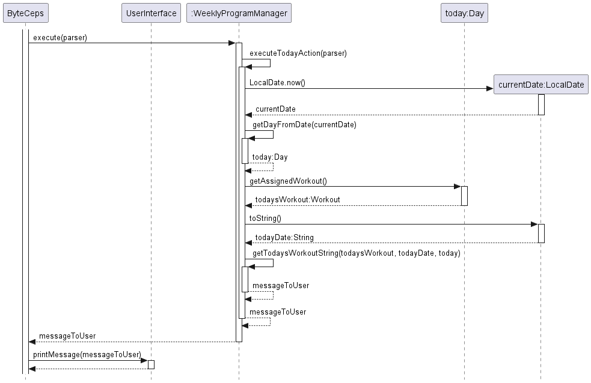
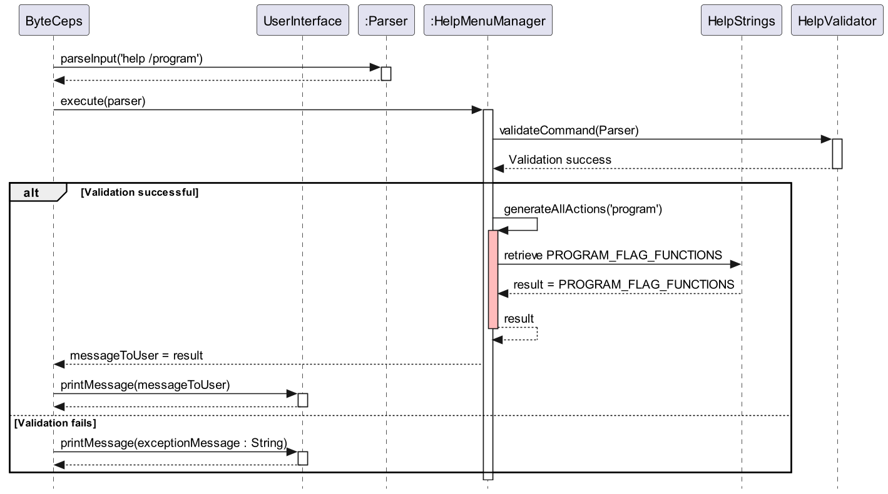
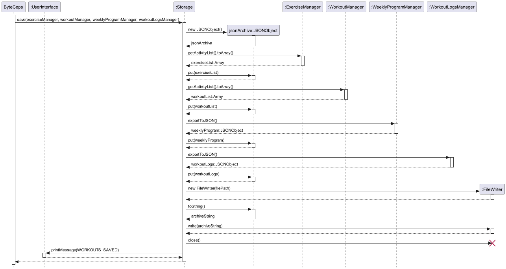
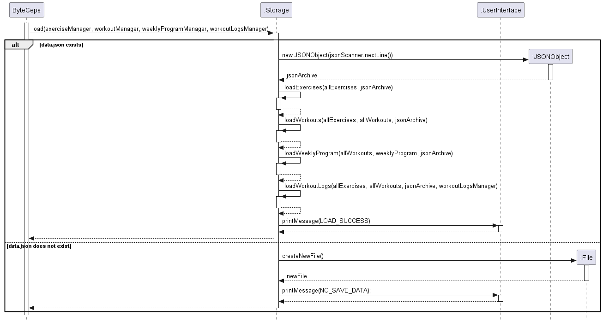
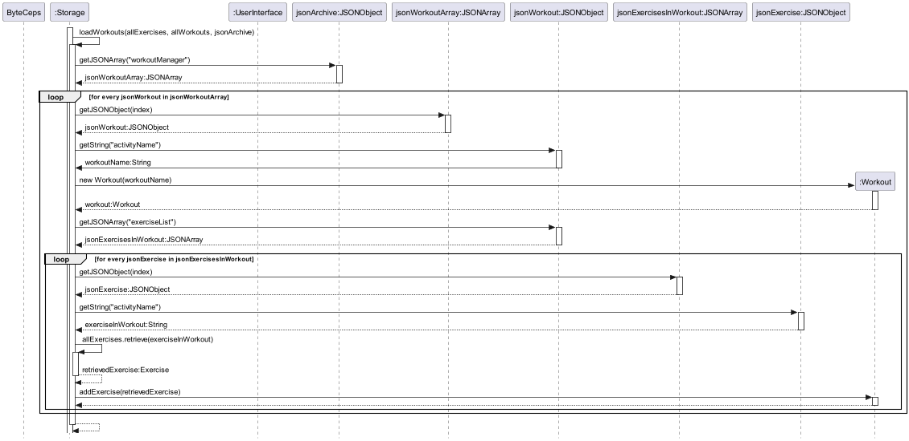
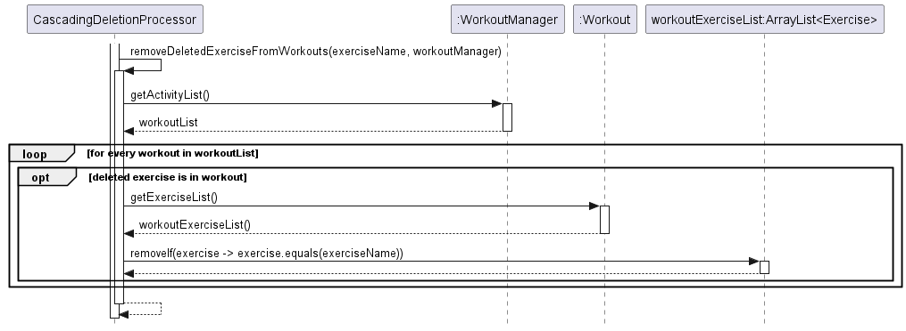

# Developer Guide

## Acknowledgements

[//]: # ({list here sources of all reused/adapted ideas, code, documentation, and third-party libraries -- include links to the original source as well})

1. [AB-3 Developer Guide](https://se-education.org/addressbook-level3/DeveloperGuide.html)
2. [PlantUML for sequence diagrams](https://plantuml.com/)

## Setting Up and Getting Started

First, fork [this repo](https://github.com/AY2324S2-CS2113-F14-3/tp), and clone the fork into your computer.

If you plan to use IntelliJ IDEA (highly recommended):

1. **Configure the JDK**: Follow the guide [se-edu/guides IDEA: Configuring the JDK](https://se-education.org/guides/tutorials/intellijJdk.html) to ensure IntelliJ is configured to use JDK 11.
2. **Import the project as a Gradle project**: Follow the guide
[se-edu/guides IDEA: Importing a Gradle project](https://se-education.org/guides/tutorials/intellijImportGradleProject.html)
to import the project into IDEA.

   :exclamation: **Note:** Importing a Gradle project is slightly different from importing a normal Java project.
3. **Verify the setup**:
   * Run `ByteCeps.java` and try a few commands.
   * Run the tests using `./gradlew check` and ensure they all pass.

---
## Design

This section provides a high-level explanation of the design and implementation of ByteCeps, 
supported by UML diagrams and short code snippets to illustrate the flow of data and interactions between the 
components.

---

### Architecture

Given below is a quick overview of main components and how they interact with each other.

## Design
### Architecture
Given below is a quick overview of the main components of ByteCeps and how they interact with each other.

**Main components of the architecture**

[ByteCeps](../src/main/java/byteceps/ByteCeps.java) is the entrypoint for the application to launch and shut down.

The bulk of ByteCep's work is done by the following components:
- [UserInterface](../src/main/java/byteceps/ui/UserInterface.java): Interacts with the user via the command line.
- [Parser](../src/main/java/byteceps/commands/Parser.java): Parses the user's input as saves their inputs in the class.
- [ExerciseManager](../src/main/java/byteceps/processing/ExerciseManager.java): Manages all the exercises stored in memory.
- [WorkoutManager](../src/main/java/byteceps/processing/WorkoutManager.java): Manages all the workouts in memory.
- [HelpMenuManager](../src/main/java/byteceps/processing/HelpMenuManager.java): Displays the help messages to the user.
- [WeeklyProgramManager](../src/main/java/byteceps/processing/WeeklyProgramManager.java): Manages the weekly program for the user in memory. 
- [WorkoutLogsManager](../src/main/java/byteceps/processing/WorkoutLogsManager.java): Managing the logging of workouts.
- [Storage](../src/main/java/byteceps/storage/Storage.java): Reads data from, and writes data to, the hard disk.

**Other notable components**:
- [Exercise](../src/main/java/byteceps/activities/Exercise.java): Stores an exercise entry by the user in memory.
- [Workout](../src/main/java/byteceps/activities/Workout.java): Stores a workout (collection of exercises) entry by the user in memory. 
- [ExerciseLog](../src/main/java/byteceps/activities/ExerciseLog.java): Stores an exercise log entry by the user in memory.
- [Exceptions](../src/main/java/byteceps/errors/Exceptions.java): Represents exceptions used by the components in the application.

## Classes: overview
### `Activity` and child classes
The `Activity` class serves as a parent class to `Exercise`, `ExerciseLog`, `Workout`, `WorkoutLog` and `Day` classes for the ease of usage of `ActivityManager` classes (see below).

**Note:** The `Day` class acts as a container class for `Workout`, for use in `WeeklyProgramManager` 

### <code>ActivityManager</code> and child classes
The <code>ActivityManager</code> and inheritors are responsible for managing an <code>ArrayList</code> of activities. The basic functions of an <code>ActivityManager</code> include:
1. <code>add()</code>: Adding an activity to the <code>ArrayList</code>
2. <code>delete()</code>: Deleting an activity from the <code>ArrayList</code>
3. <code>retrieve()</code>: Retrieving an activity from the <code>ArrayList</code> by name
4. <code>getListString()</code>: Get the string containing all the activities contained in the <code>ActivityManager</code>.
5. `execute()`: Execute all commands related to the `ActivityManager` and return the required user input.

#### The `ExerciseManager` class
`ExerciseManager` is responsible for tracking and manipulating all exercises added to `ByteCeps` by the user.

#### The `WorkoutManager` class
`WorkoutManager` is responsible for tracking and manipulating all workouts created by the user.

#### The `WeeklyProgramManager` class
`WeeklyProgram` is responsible for tracking and manipulating the weekly training program set by the user.

## Implementation
### Exercise Management
#### [Implemented] Add, Edit, Delete, List, and Search Exercises
ByteCeps streamlines the management of exercise-related tasks by following a general multi-step pattern. Here’s how these operations are carried out:

**Step 1 - Input Processing:** 
The user’s input is received and processed by ByteCeps, which involves parsing the command through the `Parser` class. User input examples include:
- `exercise /add Pushups` for adding an exercise.
- `exercise /edit Pushups /to Pullups` for editing an exercise name from Pushups to Pullups.
- `exercise /delete Pushups` for deleting the Pushups exercise.
- `exercise /list` for listing all exercises.
- `exercise /search Pushups` for finding all instances of the Pushups exercise.

**Step 2 - Command Identification:** 
The `Parser` class determines the type of exercise operation and extracts any necessary parameters. For instance, the `exercise /add` command will be recognized, and the exercise name `Pushups` will be parsed as the parameter.

**Step 3 - Command Validation**: The input is then validated using `ExerciseValidator` class to ensure that the command and parameters provided meet the expected format and criteria for processing.

**Step 4 - Command Execution**: The appropriate action is taken by the `ExerciseManager` class. 
- Adding: If the user wants to add a new exercise, `ExerciseManager` creates a new `Exercise` instance and adds it to the `ExerciseManager's activitySet`.
- Editing: When editing an exercise, `ExerciseManager` locates the existing `Exercise`, updates its details, and then updates the `activitySet` accordingly.
- Deleting: To delete an exercise, `ExerciseManager` finds the targeted `Exercise` in the `activitySet` and removes it.
- Listing: For listing exercises, `ExerciseManager` retrieves all the exercises from the `activitySet` and formats them into a list for display.
- Searching: Searching is handled by querying the `activitySet` for exercises that match the search criteria provided by the user, and presenting the results.

**Step 5 - Result Display**: After the command is executed, a message indicating the success or failure of the operation is generated and displayed to the user. This feedback is crucial for confirming the effect of the user's command on the system.

Here is the sequence diagram for the `exercise /add pushups` command to illustrate the five-step process:

### Workout Management
#### [Implemented] Add, Edit, Delete, List, and Search Workout plan.
ByteCeps streamlines the management of exercise-related tasks by following a general multi-step pattern. Here’s how these operations are carried out:

**Step 1 - Input Processing:** 
The user’s input is received and processed by ByteCeps, which involves parsing the command through the `Parser` class. User input examples include:
- `workout /create LegDay` for creating a workout plan.
- `workout /edit LegDay /to CardioBlast` for editing a workout plan name from LegDay to CardioBlast.
- `workout /delete LegDay` for deleting the LegDay workout plan.
- `workout /list` for listing all workout plans.
- `workout /search HighIntensity` for finding all workout plans containing HighIntensity.

**Step 2 - Command Identification:** 
The `Parser` class determines the type of workout operation and extracts any necessary parameters. For instance, the `workout /create` command will be recognized, and the workout plan name `LegDay` will be parsed as the parameter.

**Step 3 - Command Validation**: The input is then validated using `WorkoutValidator` class to ensure that the command and parameters provided meet the expected format and criteria for processing.

**Step 4 - Command Execution**: The appropriate action is taken by the `WorkoutManager` class. 
- Creating: If the user wants to create a new workout plan, `WorkoutManager` creates a new `Workout` instance and adds it to the `WorkoutManager's activitySet`.
- Editing: When editing a workout plan, `WorkoutManager` locates the existing `Workout`, updates its details, and then updates the `activitySet` accordingly.
- Deleting: To delete a workout plan, `WorkoutManager` finds the targeted `Workout` in the `activitySet` and removes it.
- Listing: For listing workout plans, `WorkoutManager` retrieves all the workouts from the `activitySet` and formats them into a list for display.
- Searching: Searching is handled by querying the `activitySet` for workouts that match the search criteria provided by the user, and presenting the results.

**Step 5 - Result Display**: After the command is executed, a message indicating the success or failure of the operation is generated and displayed to the user. This feedback is crucial for confirming the effect of the user's command on the system.

Here is the sequence diagram for the `workout /delete LegDay` command to illustrate the five-step process:

#### [Implemented] Assign and Unassign Workout plan.
The ByteCeps application facilitates workout management, including the assignment and unassignment of exercises to workout plans. The process is outlined in the sequence diagram provided and follows a standard operational pattern as described below:

ByteCeps streamlines the management of exercise-related tasks by following a general multi-step pattern. Here’s how these operations are carried out:

**Step 1 - Input Processing:** 
The user’s input is received and processed by ByteCeps, which involves parsing the command through the `Parser` class. User input examples include:
- `workout /assign Pushups /to LegDay`  to assign the exercise `Pushups` to the workout plan `LegDay`.
- `workout /unassign Pushups /from LegDay` to unassign the exercise `Pushups` to the workout plan `LegDay`.

**Step 2 - Command Identification:** 
The `Parser` class determines the type of workout operation and extracts any necessary parameters. For instance, the `workout /assign` command will be recognized, workout plan name `LegDay` and exercise name `Pushups` will be parsed as the parameter.

**Step 3 - Command Validation**: The input is then validated using `WorkoutValidator` class to ensure that the command and parameters provided meet the expected format and criteria for processing.

**Step 4 - Command Execution**: The appropriate action is taken by the `WorkoutManager` class. 
- Assigning: The `WorkoutManager` calls `executeAssignAction` which initiates the process to assign an exercise to a workout plan. It communicates with the `ExerciseManager` to retrieve the specified `Exercise` object. Simultaneously, it retrieves the specified `Workout` object to which the exercise will be added. The `Workout` object’s `addExercise` method is called to include the exercise within the workout plan.
- Unassigning: The `WorkoutManager` calls `executeUnassignAction` which initiates the process to unassign an exercise to a workout plan. It first retrieves the `Workout` object corresponding to `LegDay` by calling the retrieve method on the `WorkoutManager`. With the `Workout` object obtained, it attempts to find and remove the `Exercise` object representing `Pushups`. If the `Exercise` is present in the `Workout`, it is removed from the workout's exercise list.

**Step 5 - Result Display**: After the command is executed, a message indicating the success or failure of the operation is generated and displayed to the user. This feedback is crucial for confirming the effect of the user's command on the system.

Here is the sequence diagram for the `workout /assign Pushups /to LegDay` command to illustrate the five-step process:

#### [Implemented] List all exercises in a workout plan.

The feature to list all exercises within a specific workout plan is crucial for users to review their workout regimen. This section outlines the sequence of operations triggered by the `workout /info workoutplan` command, culminating in the display of all associated exercises to the user.

**Step 1 - Input Processing:** 
The user’s input is received and processed by ByteCeps, which involves parsing the command through the `Parser` class. The user initiates the process by inputting the command `workout /info workoutplan`.

**Step 2 - Command Identification:** 
The `Parser` class determines the type of workout operation and extracts any necessary parameters. For instance, the `workout /info` command will be recognized, workout plan name `workoutplan` will be parsed as the parameter.

**Step 3 - Command Validation**: The input is then validated using `WorkoutValidator` class to ensure that the command and parameters provided meet the expected format and criteria for processing.

**Step 4 - Command Execution**: The appropriate action is taken by the `WorkoutManager` class. 
- Execute Info Action: The `WorkoutManager` proceeds to execute the `executeInfoAction`, specifically tailored for fetching details about the workout plan named `workoutplan`.
- Retrieve Workout Plan: The `WorkoutManager`retrieves the `Workout` object corresponding to `workoutplan`. The `WorkoutManager` then searches its records and returns the `Workout` object to the `WorkoutManager`.
- Fetch Exercise List: The `WorkoutManager` then invokes the `getExerciseList` method on the retrieved `Workout` object to obtain a list of all exercises included in the workout plan.
- Compile Exercise Information: For each `Exercise` in the list, the `WorkoutManager` calls the `getName` method to retrieve the name of the exercise. These names are compiled into a comprehensive message detailing all exercises within the workout plan.

**Step 5 - Result Display**: After the command is executed, a message indicating the success or failure of the operation is generated and displayed to the user. This feedback is crucial for confirming the effect of the user's command on the system.
- Success Path: The compiled list of exercises is presented to the user, providing a clear overview of the workout plan's contents.
- Validation Failure: If the initial validation fails, the user is informed of the invalid command format without proceeding further into the sequence.

Here is the sequence diagram for the `workout /info workoutplan` command to illustrate the five-step process:

### Program management
#### [Implemented] Assign, List, Log workouts in Weekly program, and view today's workout plan.
ByteCeps streamlines the management of the user's weekly program by following the same general multi-step pattern as above for workout and exercise management.
Namely, the steps consist:
1. Input processing
2. Command identification
3. Command validation
4. Command execution
5. Result display

The first 2 steps will be omitted in the sequence diagrams following this overview for brevity purposes, as they are similar to the explanations offered in
workout and exercise management.

The following are the possible commands the `WeeklyProgramManager` object can run:
- `program /list` to list out the weekly program.
- `program /assign LegDay /to Monday` for assigning a workout to a specific day.
- `program /log Squats /weight 90 100 110 /reps 12 10 8 /sets 3` for logging a specific exercise done today.
- `program /clear` for clearing the entire weekly workout plan.
- `program /clear Monday` for clearing a specific day's workout plan.
- `program /today` for viewing today's workout.

#### Logging an exercise
Below is the sequence diagram of the command `program /log <EXERCISE_NAME> /weight
<WEIGHT> /sets <NUMBER_OF_SETS> /reps <NUMBER_OF_REPS> /date <DATE> ` being run:

1. After input validation, the `execute()` method of `WeeklyProgramManager` calls the `executeLogAction()` method
2. This method then calls the `.addWorkoutLog()` function of the `WorkoutLogManager`, of which its process has been described above under "**Logging of workouts**".
3. Finally, the `messageToUser` is returned to the `UserInterface`.

#### Assigning a workout to a program
Below is the sequence diagram of the command `program /assign <workout> /to <day>` being run:

1. After input validation, the `execute()` method of `WeeklyProgramManager` calls the `executeAssignAction()` method.
2. This method then retrieves the appropriate `Workout` object, and assigns it to be contained in the appropriate `Day` object.
3. Finally, the `messageToUser` is returned to the `UserInterface`.

#### Viewing today's workout program
Below is the sequence diagram of the command `program /today` being run.
The validation of user input has been omitted for purposes of brevity.

1. Today's date is retrieved in the form of a `Date` object.
2. This is used to retrieve the appropriate `Day` object.
3. The `Workout` contained in the `Day` object is retrieved.
4. The `Workout` , along with `Date` and `Day` is then converted to the `messageToUser:String`, which is returned to `execute()` and `ByteCeps` for printing.
 
#### Clearing a day in the program
This is the sequence diagram of the command `program /clear <day [optional]>` being run.
The validation of user input has been omitted for purposes of brevity.

1. If no day has been assigned to the user, the `executeClearAction()` method clears all workouts in the `WeeklyProgramManager` object.
2. Otherwise, the specified `Day` object is removed from `WeeklyProgramManager` object, and a new `Day` object with no workout assigned is constructed in its place.

### Help Menu
To implement a help menu for the user, where they can view the formatting of any command corresponding to any specific BYTE-CEPS functionality, 3 classes work together:
- [HelpMenuManager](../src/main/java/byteceps/processing/HelpMenuManager.java) : Returns help menus to be shown to the user or, if requested, a specific functionality's command format.
- [HelpStrings](../src/main/java/byteceps/ui/strings/HelpStrings.java): Stores all Strings including numbered help menu items, command formats and help menu error messages.
- [HelpValidator](../src/main/java/byteceps/validators/HelpValidator.java): Parses the input to HelpMenuManager's execute() method to ensure input validity before the rest of the method executes.

#### Viewing an flag's help menu
If the user enters the command `help /COMMAND_TYPE` where `COMMAND_TYPE` is one of the 3 possible flags:
1. `exercise`
2. `workout`
3. `program`

They will be shown a numbered list of functionalities associated with the specific flag. 

How the command `help /program` is processed and executed will be described below. This is to demonstrate how the 3 aforementioned classes interact to show a user a help menu which details the associated functionalities of a flag (for which they can see command formats).

**Step 1 - Input Processing:**
The user’s input is received and processed by ByteCeps, which involves parsing the command through the `Parser` class. The user initiates the process by inputting the command `help /program`.

**Step 2 - Command Identification:**
The `Parser` class determines the type of help operation and extracts any necessary arguments. In this case, the `help` is recognised as the command,`program` is a flag.

**Step 3 - Command Validation**: The input is then validated using `HelpValidator` class to ensure that the arguments provided meet the expected format and criteria for processing.
If validation fails, an exception is thrown with an accompanying error message. If validation succeeds, command execution proceeds.

**Step 4 - Command Execution**: The appropriate action is taken by the `HelpMenuManager` class.
- Execute generateAllActions: The `HelpMenuManager` proceeds to execute the `generateAllActions` method, which retrieves the array of `program` help menu items, `PROGRAM_FLAG_FUNCTIONS`, from `HelpStrings` class and appends each String into a single String that contains a numbered list. This is then returned.

**Step 5 - Result Display**
- Success Path: The String containg the numbered `program` help menu is presented to the user.
- Validation Failure: If the initial validation fails, the user is shown the validation failure's error message, informing them of the invalid command format without proceeding further into the sequence.

This is a sequence diagram of the command `help /program` provided to visually illustrate the described example above.

#### Viewing a specific command format 
How the command `help /exercise 1` is processed and executed will be described below to demonstrate how the 3 aforementioned classes interact to show a user command formats.

**Step 1 - Input Processing:**
The user’s input is received and processed by ByteCeps, which involves parsing the command through the `Parser` class. The user initiates the process by inputting the command `help /exercise 1`.

**Step 2 - Command Identification:**
The `Parser` class determines the type of help operation and extracts any necessary arguments. In this case, the `help` is recognised as the command,`exercise` and `1` are a flag-parameter pair.

**Step 3 - Command Validation**: The input is then validated using `HelpValidator` class to ensure that the arguments provided meet the expected format and criteria for processing.
If validation fails, an exception is thrown with an accompanying error message. If validation succeeds, command execution proceeds.

**Step 4 - Command Execution**: The appropriate action is taken by the `HelpMenuManager` class.
- Execute getFlagFormat: The `HelpMenuManager` proceeds to execute the `getFlagFormat` method, which first converts the String parameter `1` to its corresponding Integer index `0` then calls the `getExerciseFlagFormats` method for retrieving a single String command format from the `exercise` command formats menu.
- Retrieve command format: The `HelpMenuManager`retrieves the specific String command format at the index `0` in the list of `exercise` command formats found in the `HelpStrings` class.

**Step 5 - Result Display**
- Success Path: The String of the desired command format (item at position `1`/index `0` in the `exercise` help menu) is presented to the user.
- Validation Failure: If the initial validation fails, the user is shown the validation failure's error message, informing them of the invalid command format without proceeding further into the sequence.

This is a sequence diagram of the command `help /exercise 1` provided to visually illustrate the described example above.

### The `Storage` class
   A `Storage` object is responsible to reading and writing to `.json` files so that user data is saved between sessions.

#### Overview: Saving data to `data.json`
The `storage.save()` method is called with the `ExerciseManager`, `WorkoutManager`, `WeeklyProgramManager` and `WorkoutLogsManager` objects being passed in as input.

**NOTE**: plantUML does not allow for termination of lifelines after destroying an object (`:FileWriter`), but note that the lifeline should end after the red cross.
1. An empty `JSONObject`, `jsonArchive`, is created.
2. `ExerciseManager` and `WorkoutManager` objects have their list of `Activity`s converted into an `Array`, which is then `.put()` into `jsonArchive`.
3. `WeeklyProgramManager` and `WorkoutLogsManager` objects have their own `exportToJSON` method which is called. The results are again `.put()` into `jsonArchive`.
4. A `FileWriter` object is created, which writes `jsonArchive` converted to a `String` to the appropriate `filePath`.
5. The `Storage` object calls the `UserInterface` directly to print the success message.

#### Overview: Loading data from `data.json`
The `storage.load()` method is called with the empty `ExerciseManager`, `WorkoutManager`, `WeeklyProgramManager` and `WorkoutLogsManager` objects being passed in as input.
These objects are to be updated in the method.

1. If there has been no `data.json` file detected, a new `File` is created and the empty `ExerciseManager`, `WorkoutManager`, `WeeklyProgramManager` and `WorkoutLogsManager`
 is returned without modification.
2. Else, a new `JSONObject` called `jsonArchive`, loaded from `data.json` is created.
3. Each `ActivityManager` object is then loaded sequentially using `jsonArchive` as input.

#### Example: Loading data for a specific `ActivityManager` class
From the last sequence diagram, we see that each `ActivityManager` class is loaded from `jsonArchive` via its own method.
For example, the `WorkoutManager` object is loaded from the `loadWorkouts()` method. The below sequence diagram shows how `loadWorkouts()` is run. 
The loading of other `ActivityManager` objects is similar in nature.

1. The `jsonWorkoutArray` is first retrieved from `jsonArchive`.
2. Then, the workout name of each `jsonWorkout` in `jsonWorkoutArray` is retrieved.
3. These workout names are used to create new `Workout` objects contained in `WorkoutManager`.
4. The exercise list, `jsonExercisesInWorkout` inside each `jsonWorkout` is retrieved.
5. The exercise name of each `jsonExercise` in `jsonExercisesInWorkout` is used to assign the correct exercises in `ExerciseManager` to each `Workout` object.

### The `CascadingDeletionProcessor` class
This class is a utility class that is responsible for handling cascading deletions (eg. when an exercise assigned to an existing workout is deleted from `ByteCeps` by the user).
It removes the required `Workout`/`Exercise` objects from the `Workout`/`WeeklyProgramManager` silently whenever a `delete` command is called.
Its only public method, `checkForCascadingDeletions()`, is run after executing a parsed command.

#### Removing a deleted exercise from a workout
If the command entered by the user starts with `exercise /delete` and is executed successfully, the private method `removeDeletedExerciseFromWorkouts()` is run:

1. `removeDeletedExerciseFromWorkouts()` iterates through every `Workout` in `WorkoutManager`.
2. If the deleted `exerciseName` matches that of an exercise in the `Workout`, the exercise is deleted from the workout too.

#### Removing a deleted workout from the weekly program
If the command entered by the user starts with `workout /delete` and is executed successfully, the private method `removeDeletedWorkoutsFromProgram()` is run:

1. A copy of all 7 `Days` in `WeeklyProgramManager` is stored as `oldWorkoutsInProgram`.
2. `removeDeletedWorkoutsFromProgram()` iterates through every `Day` in `oldWorkoutsInProgram`.
3. If the name of the `Workout` assigned to a particular `Day`  matches that of the deleted `Workout`, 
   that particular `Day` is deleted from `newWorkoutsInProgram` .
4. A new `Day` with no `Workout` assigned to it is added to `newWorkoutsInProgram` in replacement of the deleted `Day`.
   
 
## Product scope
### Target user profile

BYTE-CEPS, a CLI-based all-in-one tool for setting and tracking fitness goals. Whether you're a tech-savvy fitness enthusiast or just starting your fitness journey, BYTE-CEPS offers the simplicity and efficiency of a CLI interface to help you maintain or improve your fitness through self-managed routines.

### Value proposition

ByteCeps offers a streamlined and comprehensive platform to manage exercise routines, track workout progress, and design personalized fitness programs with ease and efficiency for fitness enthusiasts and professionals. 

1. Streamlined Exercise Management: ByteCeps simplifies the organization of exercise routines by providing a user-friendly interface to add, edit, delete, list and search exercises effortlessly.
2. Effortless Workout Planning: Create personalized workout plans by assigning exercises to specific days with intuitive CLI commands, ensuring organized and effective training sessions tailored to your needs.
3. Flexible Program Adaptation: Seamlessly adjust workout plans and schedules as needed with the ability to add, remove, or modify exercises on the fly, providing flexibility and adaptability to your evolving fitness journey.
4. Comprehensive Progress Tracking: Log and monitor workout performance, including weights, sets, and reps, with detailed exercise logs and historical data, enabling you to track progress, identify trends, and stay motivated.

With ByteCeps, achieve your fitness objectives efficiently, effectively, and enjoyably, unlocking your full potential for a healthier, fitter lifestyle.

## User Stories

| Version | As a ... | I want to ...             | So that I can ...                                           |
|---------|----------|---------------------------|-------------------------------------------------------------|
| v1.0    | user     | create an exercise entry             | begin tracking my exercises                      |
| v1.0    | user     | create edit an exercise entry        | modify an exercise to suit my needs              |
| v1.0    | user     | delete an exercise entry             | remove unwanted exercises that I will not do     |
| v1.0    | user     | add an exercise to a workout plan    | customise my workout plan                        |
| v1.0    | user     | edit an exercise in a workout plan   | modify the workout plan to suit my needs         |
| v1.0    | user     | delete an exercise from workout plan | remove unwanted exercises from a workout plan    |
| v1.0    | user     | list all exercises in a workout plan | see the details of my planned exercises          |
| v1.0    | user     | choose the workout plan for a day    | organise and structure my daily workout routine  |
| v1.0    | user     | display my workout for the day       | know what exercises I should be doing today      |
| v1.0    | user     | display my workout for the week      | have a weekly overview of what I should do       |
| v2.0    | user     | export my workout plan to Json       | share with other fitness enthusiasts             |
| v2.0    | user     | import my workout plan to Json       | bring my progress across devices                 |
| v2.0    | user     | search for exercises                 | build my workout plan faster                     |
| v2.0    | user     | search for workout plans             | identify which is the suitable workout for me    |
| v2.0    | fitness enthusiast   | record the amount of weight lifted                             | track my progress over time                                       |
| v2.0    | fitness enthusiast   | track the number of sets performed for each exercise session   | follow my workout plan effectively                                |
| v2.0    | fitness professional | monitor the repetitions completed for each exercise            | evaluate my clients' performance and provide tailored feedback    |
| v2.0    | fitness professional | log my exercise data for a specific date                       | accurately track my progress over time                            |
| v2.0    | fitness professional | view a list of dates on which I have logged exercise entries   | track my consistency and adherence to my workout routine          |
| v2.0    | fitness professional | review specific exercise logs for a particular date            | analyze my workout details and progress on that specific day      |
| v2.1    | fitness professional |  log multiple sets of an exercise, including different weights and reps for each set            |  have a comprehensive log of my exercise sessions to monitor variations in my performance and strength training progress     |
| v2.1    | fitness professional |  access and review historical workout data with detailed breakdowns by exercise, set, weight, and repetition            |  analyze trends in my performance and identify areas for improvement or adjustment in my training regime     |

## Non-Functional Requirements

1. BYTE-CEPS should work on Windows, macOS and Linux that has Java 11 installed.
2. BYTE-CEPS should be able to store data locally.
3. BYTE-CEPS should be able to work offline.
4. BYTE-CEPS should be easy to use.

## Glossary

* *glossary item* - Definition

## Instructions for manual testing

**Note**: This section serves to provide a quick start for manual testing on BYTE-CEPS. This list is not exhaustive.
Developers are expected to conduct more extensive tests.

### Initial Launch

* ✅ Download the latest BYTE-CEPS from the official repository.
* ✅ Copy the downloaded file to a folder you want to designate as the home for BYTE-CEPS.
* ✅ Open a command terminal, cd into the folder where you copied the file, and run `java -jar byteceps.jar`.

### Exercise Management
1. Adding an Exercise:
    - Test case 1:
        * Add a new exercise.
        * Command: `exercise /add pushups`
        * Expected Outcome: The system should confirm that the exercise `pushups`has been added.
    - Test case 2:
        * Add an exercise with special characters.
        * Command: `exercise /add push-ups!`
        * Expected Outcome: The system should display an error message indicating that the exercise name cannot contain special characters.
    - Test case 3:
        * Add a duplicate exercise.
        * Command: `exercise /add pushups` 
        * Expected Outcome: The system should display an error message indicating that the exercise already exists.
    - Test case 4:
        * Add an exercise with a case variation in name.
        * Command: `exercise /add PUSHUPS` 
        * Expected Outcome: The system should display an error message indicating that the exercise already exists, as the exercise name is case insensitive.
2. Deleting an Exercise:
    - Test case 1:
        * Delete an existing exercise.
        * Command: `exercise /delete pushups`
        * Expected Outcome: The system should confirm that the exercise `pushup` has been deleted. 
    - Test case 2:
        * Attempt to delete a non-existent exercise.
        * Command: `exercise /delete situps`
        * Expected Outcome: The system should display an error message indicating that the exercise does not exist.
    - Test case 3:
        * Delete an exercise with a case variation in name.
        * Command: `exercise /delete PUSHUPS`
        * Expected Outcome:  Since exercise names are case insensitive, the system should successfully delete the 'pushups' exercise, confirming that case sensitivity is handled correctly.
3. Listing All Exercises:
    - Test case 1:
        * List all exercises.
        * Command: `exercise /list`
        * Expected Outcome: The system should display all current exercises stored in the system, regardless of the order they were added.
    - Test case 2:
        * List exercises when no exercises have been added.
        * Command: `exercise /list`
        * Expected Outcome: The system should display a message indicating that there are no exercises to display.
4. Editing an Exercise:
    - Test case 1:
        * Edit an existing exercise name.
        * Command: `exercise /edit pushups /to Decline pushups`
        * Expected Outcome: The system should confirm that the exercise name has been changed from `pushups` to `Decline pushups`
    - Test case 2:
        * Attempt to edit a non-existent exercise.
        * Command: `exercise /edit crunches /to Incline crunches`
        * Expected Outcome: The system should display an error message indicating that the original exercise does not exist.
    - Test case 3:
        * Edit an exercise to have a special character in the new name.
        * Command: `exercise /edit Decline pushups /to Decline-pushups!`
        * Expected Outcome: The system should display an error message indicating that the new name cannot contain special characters.
    - Test case 4:
        * Edit an exercise using the same existing name.
        * Command: `exercise /edit Decline pushups /to Decline pushups`
        * Expected Outcome: The system should notify that the new name is the same as the old name.
5. Searching for Exercises:
    - Test case 1:
        * Search for an exercise by partial name match.
        * Command: `exercise /search push`
        * Expected Outcome: The system should return all exercises that partially match `pushups`, including `pushups` and `Decline pushups`
    - Test case 2:
        * Search for an exercise with no matching entries.
        * Command: `exercise /search pullups`
        * Expected Outcome: The system should display a message indicating no search results.
    - Test case 3:
        * Search for an exercise using a complete name.
        * Command: `exercise /search Decline pushups`
        * Expected Outcome: The system should display only the `Decline` pushups exercise, ensuring that exact matches are correctly prioritized over partial matches.
    - Test case 4:
        * Search for an exercise immediately after deletion.
        * Command: `exercise /search decline pushups` after deleting `decline pushups`
        * Expected Outcome: The system should indicate that there are no results for `decline pushups`, confirming that the deletion was processed correctly.

### Workout Management
1. Adding a Workout Plan:
    - Test case 1:
        * Create a new workout plan.
        * Command: `workout /create Leg Day`
        * Expected Outcome: The system should confirm that the workout plan `leg day` has been created.
    - Test case 2:
        * Add a new workout plan with special characters.
        * Command: `exercise /add push-ups!`
        * Expected Outcome: The system should display an error message stating that the workout plan name cannot contain special characters.
    - Test case 3:
        * Add a duplicate workout plan.
        * Command: `workout /create Arm-Day` 
        * Expected Outcome: The system should display an error message indicating that the workout plan already exists.
    - Test case 4:
        * Add a Workout plan with a case variation in name.
        * Command: `workout /create LEG DAY` 
        * Expected Outcome: The system should display an error message indicating that the workout plan already exists, as the workout plan name is case insensitive.
2. Deleting a Workout Plan:
    - Test case 1:
        * Delete an existing workout plan.
        * Command: `workout /delete leg day`
        * Expected Outcome: The system should confirm that the workout plan `leg day` has been deleted. 
    - Test case 2:
        * Attempt to delete a non-existent exercise.
        * Command: `workout /delete back day`
        * Expected Outcome: The system should display an error message indicating that the workout plan does not exist.
    - Test case 3:
        * Delete a workout plan with a case variation in name.
        * Command: `workout /delete LEG DAY`
        * Expected Outcome:  Since workout names are case insensitive, the system should successfully delete the 'leg day' workout, confirming that case sensitivity is handled correctly.
3. Listing All Workout Plan:
    - Test case 1:
        * List all workout plan.
        * Command: `workout /list`
        * Expected Outcome: The system should display all workout plans stored in the system, regardless of the order they were added.
    - Test case 2:
        * List exercises when no exercises have been added.
        * Command: `workout /list`
        * Expected Outcome: The system should display a message indicating that there are no workout plans to display.
4. Editing a Workout Plan:
    - Test case 1:
        * Edit an existing workout plan name.
        * Command: `workout /edit leg day /to back day`
        * Expected Outcome: The system should confirm that the workout plan name has been changed from `leg day` to `back day`
    - Test case 2:
        * Attempt to edit a non-existent workout plan.
        * Command: `workout /edit chest day /to pull day`
        * Expected Outcome: The system should display an error message indicating that the original workout plan `chest day` does not exist.
    - Test case 3:
        * Edit a workout plan to have a special character in the new name.
        * Command: `workout /edit Full Body Day /to Full Body Day-`
        * Expected Outcome: The system should display an error message indicating that the new name cannot contain special characters.
    - Test case 4:
        * Edit a workout plan using the same existing name.
        * Command: `workout /edit Full Body Day /to Full Body Day`
        * Expected Outcome: The system should notify that the new name is the same as the old name.
5. Searching for workout plan:
    - Test case 1:
        * Search for an exercise by partial name match.
        * Command: `workout /search day`
        * Expected Outcome: The system should return all workout plans that partially match `day`, including `leg day` and `back day`
    - Test case 2:
        * Search for a workout plan with no matching entries.
        * Command: `exercise /search chest`
        * Expected Outcome: The system should display a message indicating no search results.
    - Test case 3:
        * Search for an exercise using a complete name.
        * Command: `exercise /search leg day`
        * Expected Outcome: The system should display only the `leg day` workout plan, ensuring that exact matches are correctly prioritized over partial matches.
    - Test case 4:
        * Search for an exercise immediately after deletion.
        * Command: `workout /search leg day` after deleting `leg day`
        * Expected Outcome: The system should indicate that there are no results for `leg day`, confirming that the deletion was processed correctly.     
6. Assigning Exercises to Workout plan:
    - Test case 1:
        * Assign an exercise to a workout plan.
        * Command: `workout /assign pushups /to Push Day`
        * Expected Outcome: The system should confirm that `pushups` have been assigned to `Push Day`.
    - Test case 2:
        * Attempt to assign an exercise to a non-existent workout plan.
        * Command: `workout /assign squats /to Nonexistent Plan`
        * Expected Outcome: The system should indicate that the workout plan does not exist.
    - Test case 3:
        * Attempt to assign a non-existent exercise to a workout plan.
        * Command: `workout /assign Nonexistent exercise /to Push Day`
        * Expected Outcome: The system should indicate that the exercise does not exist.
    - Test case 4:
        * Assign an exercise to a workout plan with a case variation in name.
        * Command: `workout /assign PUSHUPS /to PUSH DAY`
        * Expected Outcome: The system should confirm that `pushups` have been assigned to `Push Day` as both the workout plan & exercise name are case insensitive.      
7. Unassigning Exercises to Workout plan:
    - Test case 1:
        * Unassign an exercise from a workout plan.
        * Command: `workout /unassign pushups /from Push Day`
        * Expected Outcome: The system should confirm that `pushups` have been removed from `Push Day`.
    - Test case 2:
        * Attempt to unassign an exercise from a non-existent workout plan.
        * Command: `workout /unassign squats /from Nonexistent Plan`
        * Expected Outcome: The system should indicate that the workout plan does not exist.
    - Test case 3:
        * Attempt to unassign a non-existent exercise from a workout plan.
        * Command: `workout /unassign Nonexistent exercise /from Push Day`
        * Expected Outcome: The system should indicate that the exercise does not exist.
    - Test case 4:
        * Unassign an exercise to a workout plan with a case variation in name.
        * Command: `workout /unassign PUSHUPS /from PUSH DAY`
        * Expected Outcome: The system should confirm that `pushups` have been unassigned from `Push Day` as both the workout plan & exercise name are case insensitive.
8. Viewing Exercises in a Workout Plan:
    - Test case 1:
        * List all exercises in a specific workout plan.
        * Command: `workout /info Push Day`
        * Expected Outcome: The system should list all exercises included in `Push Day`. If the workout plan is empty, the system should indicate that there are no exercises.
    - Test case 2:
        * View an empty workout plan.
        * Command: `workout /info Newbie Plan` (assuming no exercises have been assigned to `Newbie Plan`)
        * Expected Outcome: The system should indicate that there are no exercises listed in `Newbie Plan`.
    - Test case 3:
        * View a workout plan with a case variation in name.
        * Command: `workout /info PUSH DAY`
        * Expected Outcome: The system should either display the details for `push day` confirming case insensitivity.

       
   
