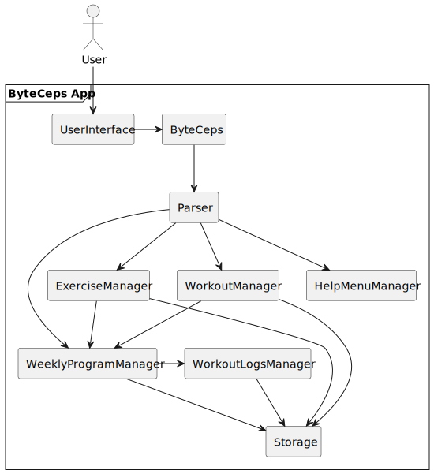
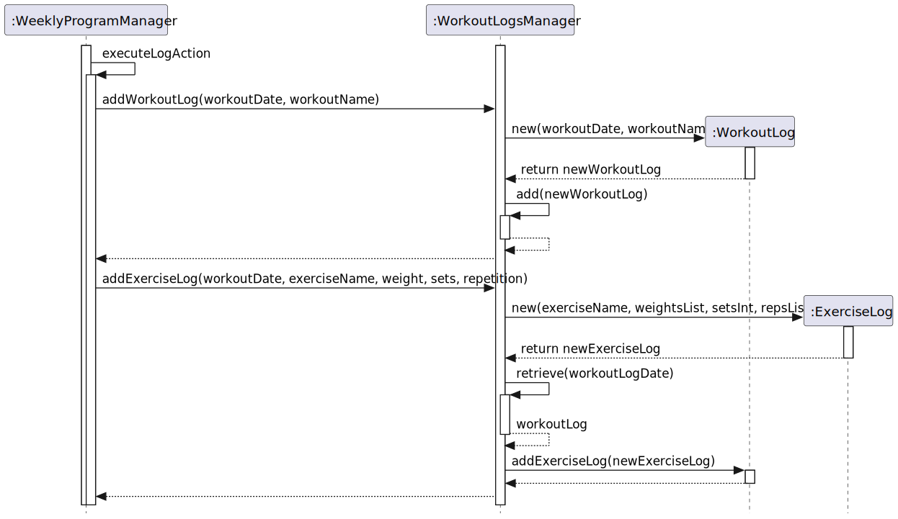

# Project: ByteCeps
BYTE-CEPS is a CLI-based tool for setting and tracking fitness goals.
The user interacts with the tool using commands entered via the CLI interface. With BYTE-CEPS, they can compile a list of exercises, build custom workouts, assign workouts to a weekly schedule and log details of each exercise completed in each performed workout.

BYTE-CEPS is written in Java, and has approximately 5.6 kLoC.

## Summary of Contributions
### Code contributed
* Do check out the RepoSense link [here](https://nus-cs2113-ay2324s2.github.io/tp-dashboard/?search=&sort=groupTitle&sortWithin=title&timeframe=commit&mergegroup=&groupSelect=groupByRepos&breakdown=true&checkedFileTypes=docs%7Efunctional-code%7Etest-code%7Eother&since=2024-02-23&tabOpen=true&tabType=authorship&tabAuthor=joshualeejunyi&tabRepo=AY2324S2-CS2113-F14-3%2Ftp%5Bmaster%5D&authorshipIsMergeGroup=false&authorshipFileTypes=docs%7Efunctional-code%7Etest-code%7Eother&authorshipIsBinaryFileTypeChecked=false&authorshipIsIgnoredFilesChecked=false)!

### Skeleton of the project
As we were discussing and preparing for the implementation of ByteCeps, I drafted and wrote the abstractions that most of the features were built on top of. 
Namely, the Activity and ActivityManager abstract base classes that are used for all other features in the project.     

### Features implemented
#### New feature: Users have the ability to log their workouts
For all users on ByteCeps, they are encouraged to keep to their workout plan by logging their exercises as they go about their workouts. 
Through the `program /log` command, with the appropriate parameters, they will then be able to log an exercise.
I planned and implemented this feature which has several layers to implement, and is more elaborated on in the Developer Guide.

#### New feature: Users have the ability to see the past logs that they have added
Users are able to specify a date to see the logged exercises, using the `program /history` command.
This will list all the exercises that they have done, along with the weights, number of sets and repetitions that they have completed.
I implemented this history feature on top of the ability to log as users would always want to keep track of their progress.

#### New feature: Logged workouts are stored in the save file
As users log their workouts to keep track of their progress, it is pivot that their data is saved properly. 
I implemented the processing of all the workout log data into the json file.

### Enhancements made
### Enhancement: Add usage messages on incomplete commands
After a round of user testing, an important feedback from the users was that incomplete commands did not guide them to what the correct commands were to be inputted.
As such, I tweaked all print messages to reflect the commands that they needed to input instead of a generic error message. 

### Contributions to the UG:
* Added the Table of Contents for the UG
* Authored the Program Management / Workout Logging section of the UG
* Contributed to standardizing the language and format of the UG

### Contributions to the DG:
#### Sections contributed:
* Contributed to the Architecture section 
* Described in detail regarding the flow and process of Logging an exercise

#### Added UML diagrams:
* Class Diagram for ByteCeps Architecture:

* Sequence diagram for logging workouts:

### Contributions to team-based tasks
* Setup organization in GitHub
* Regularly followed up on issues and PRs
* Examples of PR reviewed:
    * [Add Storage class and functionality](https://github.com/AY2324S2-CS2113-F14-3/tp/pull/60#pullrequestreview-1956391203)
    * [Refactor code to use UserInterface.printMessage() ](https://github.com/AY2324S2-CS2113-F14-3/tp/pull/30#discussion_r1527492503)

### Contributions beyond the project team
* PE dry Run:
    * [Screenshot captured during PE dry run](https://github.com/joshualeejunyi/ped/tree/main/files)
* DG review for other teams:
    * [Timetable Comparer](https://github.com/nus-cs2113-AY2324S2/tp/pull/39)
