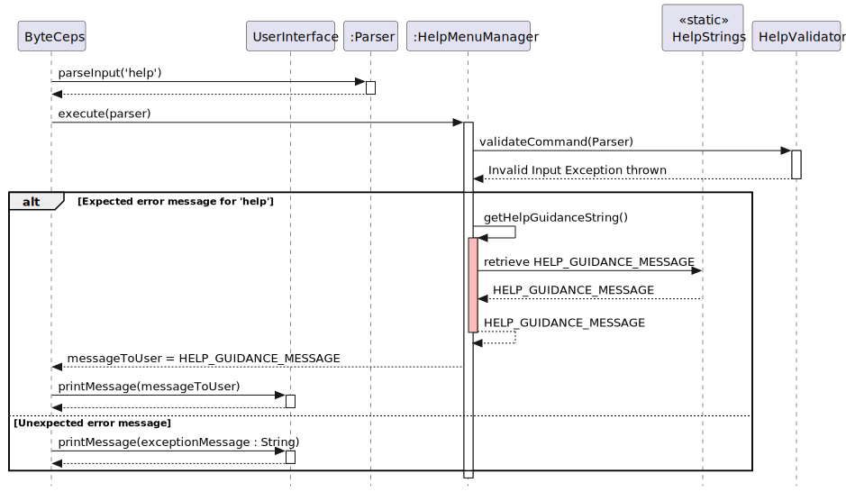
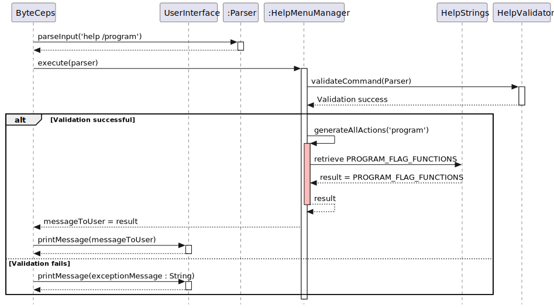
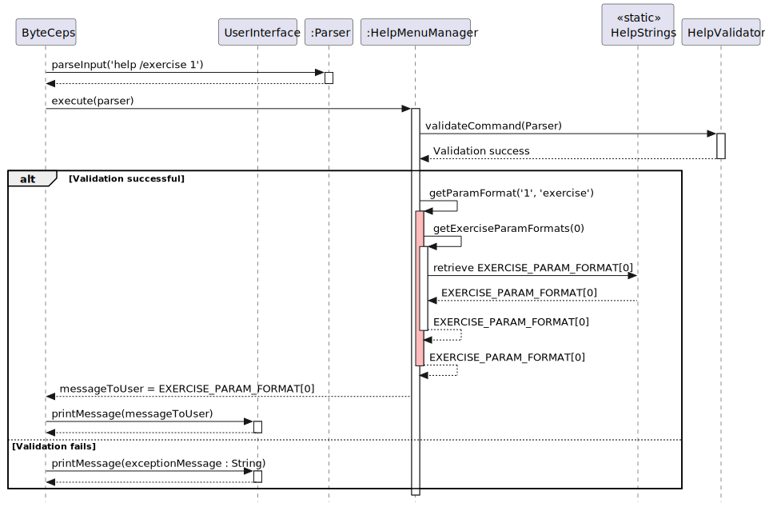

# Lukas Ethan Wachtel's Project Portfolio Page

## Project: ByteCeps
BYTE-CEPS is a CLI-based tool for setting and tracking fitness goals. 
The user interacts with the tool using commands entered via the CLI interface. With BYTE-CEPS, they can compile a list of exercises, build custom workouts, assign workouts to a weekly schedule and log details of each exercise completed in each performed workout. 

## Summary of Contributions

### New Features
+ **Help menu**:  Shows the user how to correctly format each possible BYTE-CEPS command.
    + What it does: Upon initial program execution, a guidance message detailing the commands to access the help menu is displayed. A user can enter 1 of these commands to view 3 different lists, each one with numbered items describing the functionalities associated with a category tracked by BYTE-CEPS. They can then see a given functionality's specific command formatting by entering the previous command along with the number from its help menu list position as a parameter.
    + Credits: I wrote the initial HelpMenuManager class, and **_joshualeejunyi_** & **_pqienso_** refined my code. I then added functionality to view the access guidance message whenever the user enters `help` alone.
+ **Editing an exercise**: Allows user to change name of an already created exercise.

### Enhancements to Existing Features 
+ **`validators` package & its accompanying classes**: Ensures our classes within the processing package follow the single responsibility principle (SRP).
     + What it does: Each `Validator`-type class parses the inputs provided for the methods in its corresponding `Manager` class, checking input validity according to conditional statements and throwing exceptions if invalid.
     + Justification: This abstracts the input parsing & validation process out of the `Manager`-type classes, thus ensuring they have a single responsibility, which is user command execution.
     + Credits: I wrote the initial validators package. Each class method within a `Validator`-type class was public and corresponded to a `Manager` method by which it was called to parse & validate input, before the `Manager` method executed its task.
      **_pqienso_** significantly improved said package by changing each `Validator`-type class to have only one public method, which is  called from the `Validator`-type class `execute()` method. This public `Validator` method calls another private method that validates input for the specific private `Manager` method that `execute()` has called to execute the user's command. 
+ **Testing `Storage` methods**: 75% of methods within `Storage` are covered.
    + Credits: I wrote all test methods within the `StorageTest` class and the helper methods for file handling. **_joshualeejunyi_** wrote `setup()`, `setUpStreams()`and `restoreStreams()`, which are integral to the functioning of the test methods.
+ **Testing `ExerciseManager` method for editing an exercise**: Enables my teammates and I, as well as any future developers, to ensure that the functionality for editing an exercise name is working properly.
  + What it does: It tests that the `execute()` method in `ExerciseManager` edits an exercise under conditions where success is expected and throw exceptions under conditions where editing should fail.
  + Credits: I wrote all test methods for editing an exercise. However, other tests written by my teammates acted as helpful guidance.
+ **Testing `HelpMenuManager` and `HelpValidator` methods**: 87% of methods within `HelpMenuManager` and 100% within `HelpValidator` are covered.
  + Credits: I wrote all test methods. I reused and adapted **_joshualeejunyi_**'s `setup()`, `setUpStreams()`and `restoreStreams()` methods.
+ **Bug fixes**:
    + [Issue #114](https://github.com/AY2324S2-CS2113-F14-3/tp/issues/114): Implemented a [fix](https://github.com/AY2324S2-CS2113-F14-3/tp/pull/139) for a logging bug where a user was unable to log two of the same exercise on the same day; I did this by overriding the existing `equals()` method used by `ExerciseLog`, which was the bug's cause. 
    + [Issue #69](https://github.com/AY2324S2-CS2113-F14-3/tp/issues/69): Use of the `HashSet` class was causing incorrect ordering in exercise & workout lists, so I implemented a [fix](https://github.com/AY2324S2-CS2113-F14-3/tp/pull/92) by using the `LinkedHashSet` class instead.
    + [Issue #44](https://github.com/AY2324S2-CS2113-F14-3/tp/issues/44): Implemented [fixes](https://github.com/AY2324S2-CS2113-F14-3/tp/pull/49) for unhandled exceptions for `week` (now called `program`).

### Code Contributed 
[LWachtel1 RepoSense](https://nus-cs2113-ay2324s2.github.io/tp-dashboard/?search=lwachtel1&breakdown=true)

### Documentation
+ **Javadocs**: Added Javadocs to all non-trivial methods in the `HelpMenuManager` and `HelpValidator` classes, as well as adding class header comments for both classes.
+ **UG**:
    + Added all documentation for the help menu and related commands.
+ **DG**:
    + Wrote whole help menu section, including descriptions for the component interactions behind each type of help menu related command.
    + Added all sequence diagrams for the help menu section  
    + Added to **_v4vern_**'s manual testing section regarding the help menu.

### Community (Contributions to the Team and Beyond):
+ Review teammate PRs
+ Reported an above-average number of bugs during the PE dry run, 8 bugs, for the team working on MediTracker.
  + See [proof of contributions here](https://github.com/LWachtel1/ped/tree/main/files).

## Contributions to DG: Extracts
`help` command sequence diagram:\

`help /FLAG` command sequence diagram:\

`help /FLAG PARAMETER` command sequence diagram:\

