# Lim Yu An - Project Portfolio Page

## Project: ByteCeps
BYTE-CEPS is a CLI-based tool for setting and tracking fitness goals.
The user interacts with the tool using commands entered via the CLI interface. With BYTE-CEPS, they can compile a list of exercises, build custom workouts, assign workouts to a weekly schedule and log details of each exercise completed in each performed workout.

### Summary of Contributions
All code contributed can be seen on the tP dashboard
 [here](https://nus-cs2113-ay2324s2.github.io/tp-dashboard/?search=&sort=totalCommits%20dsc&sortWithin=title&timeframe=commit&mergegroup=&groupSelect=groupByRepos&breakdown=true&checkedFileTypes=docs~functional-code~test-code~other&since=2024-02-23&tabOpen=true&tabType=authorship&tabAuthor=pqienso&tabRepo=AY2324S2-CS2113-F14-3%2Ftp%5Bmaster%5D&authorshipIsMergeGroup=false&authorshipFileTypes=docs&authorshipIsBinaryFileTypeChecked=false&authorshipIsIgnoredFilesChecked=false).

### Features implemented

#### Parser and User Interface
  - Created initial iteration of `Parser` and `UserInterface` classes
    - Created the `Parser` class that takes in user input and outputs the command actions
      arguments in the form of a `HashSet`.
    - Created the `UserInterface` class that is responsible for taking in user input and
         printing to `System.out`.
    
#### New feature: Weekly Program Management
  - Added the `program` functionality.
    - Created the class `WeeklyProgramManager` that handles all commands starting with
      `program`, allowing users to create and customise their weekly workout plan.
  - Commands implemented:
    - List: `program /list`
    - Assign workout: `program /assign <WORKOUT_NAME> /to <DAY>`
    - Clear program: `program /clear <DAY [optional]>`
    - View today's program: `program /today`

#### New feature: saving to storage
  - Added the functionality of saving user data to a `.json` file
    - Created the initial iteration of the `Storage` class which loads and saves user data
      to and from a `.json` file using [this JSON-java library](https://github.com/stleary/JSON-java).

#### New feature: cascading deletion management
  - Added the ability for `ByteCeps` to handle cascading deletions
    - Created the `CascadingDeletionProcessor` class that checks for cascading deletions
      (eg. when an exercise assigned to an existing workout is deleted from `ByteCeps` by the user)
      , allowing for the .json files to load properly after such deletions.
  - This utility class is called only after successful execution of a command in `ByteCeps.runCommandLine()`.
    - This is because `CascadingDeletionProcessor` involves multiple `ActivityManager` classes. Hence, its public
      method is only called in `ByteCeps`, which already handles these classes, to minimise coupling.
    
#### Refactoring: Refactored `ActivityManager` classes to reduce coupling
- Previously, `ActivityManager` classes had scattered calls to `UserInterface.printMessage()` in all of their methods, causing high coupling and low maintainability of code.
- Thus, the `ActivityManager`'s `execute()` classes were refactored such that they returned the `messageToUser` to `ByteCeps`,
  and only then is `UserInterface.printMessage()` is called.
- This greatly reduced coupling, as `UserInterface` was now only associated with `ByteCeps` and `Storage` classes,
  as compared to previously where there were associations with all `ActivityManager` classes.

#### Refactoring: Abstraction of user input validation
  - Refactored all `Validator` public methods, standardizing them to return `void` and only throw `Exceptions.InvalidInput` when validation fails.
    - This is to better adhere to SRP, since the `Validator` methods were previously returning processed inputs if the inputs were valid.
      This led to an overlap in responsibilities between the `ActivityManager` and `Validator` classes.

#### Contributions to team-based tasks
  - Managed releases [`v1.0`](https://github.com/AY2324S2-CS2113-F14-3/tp/releases/tag/v1.0),
   [`v2.0`](https://github.com/AY2324S2-CS2113-F14-3/tp/releases/tag/v2.0)
  - Reviewed PRs ([example](https://github.com/AY2324S2-CS2113-F14-3/tp/pull/153))
  - [Raised issues](https://github.com/AY2324S2-CS2113-F14-3/tp/issues?q=is%3Aissue+is%3Aclosed+author%3Apqienso)
  - [Fixed bugs](https://github.com/AY2324S2-CS2113-F14-3/tp/issues?q=is%3Aissue+is%3Aclosed+assignee%3Apqienso+label%3Abug)

#### User Guide contributions
  - Added precautions of cascading deletions to user guide
  - Contributed to summary table of all commands

#### Developer Guide contributions
  - Created class diagrams of all `Activity` classes and `ActivityManager` classes, along with their overview and explanation.
  - Documented all implementation details for `WeeklyProgramManager`.
  - Documented all implementation details for the `Storage` class.
  - Documented all implementation details for the `CascadingDeletionProcessor` class.

#### Contributions to DG: extracts
`Activity` class diagram:\
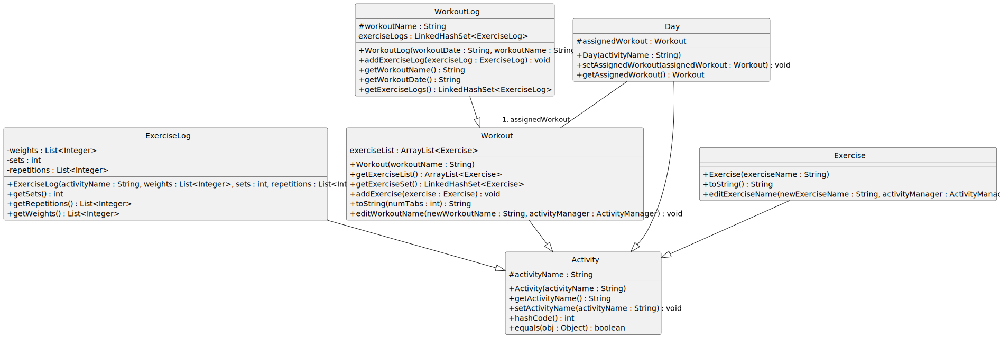\
`ActivityManager` class diagram:\
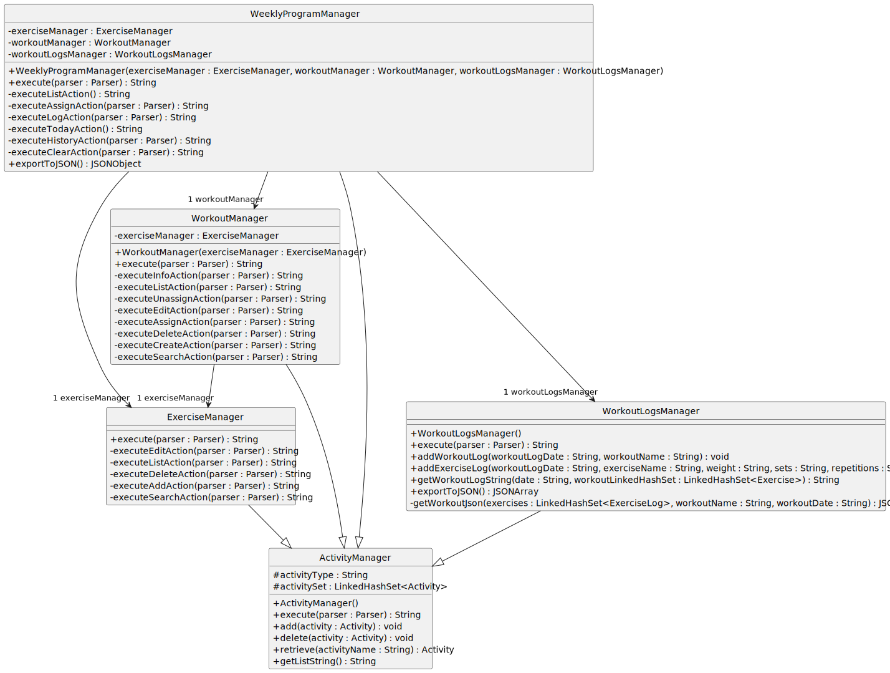

`program /assign ...` sequence diagram: \
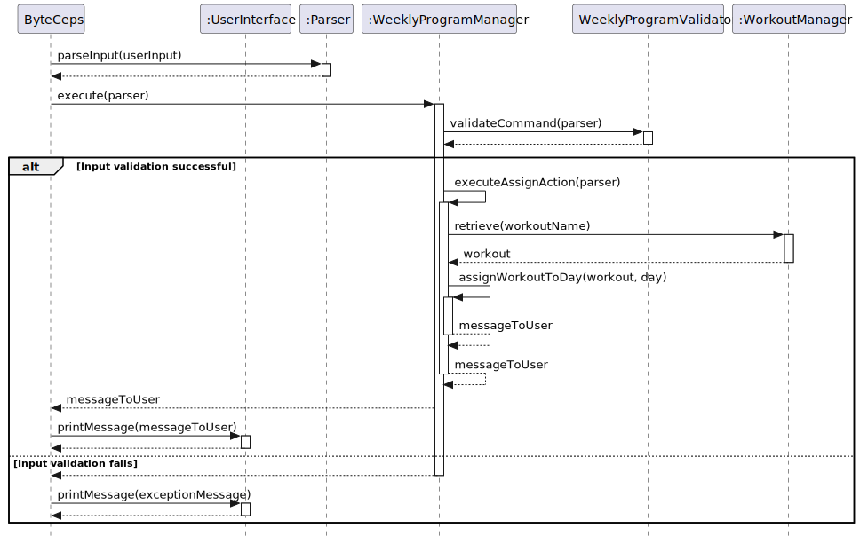\
`program /log ...` sequence diagram:\
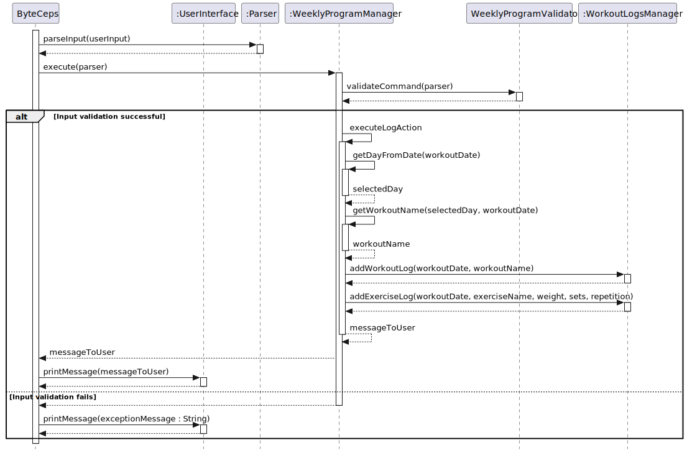\

`program /clear ...` sequence diagram:\
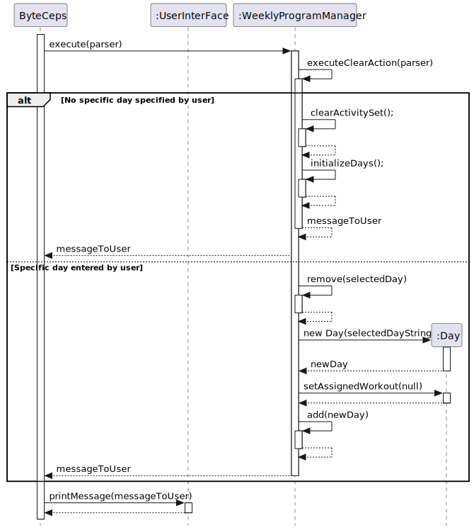\
`program /today` sequence diagram:\
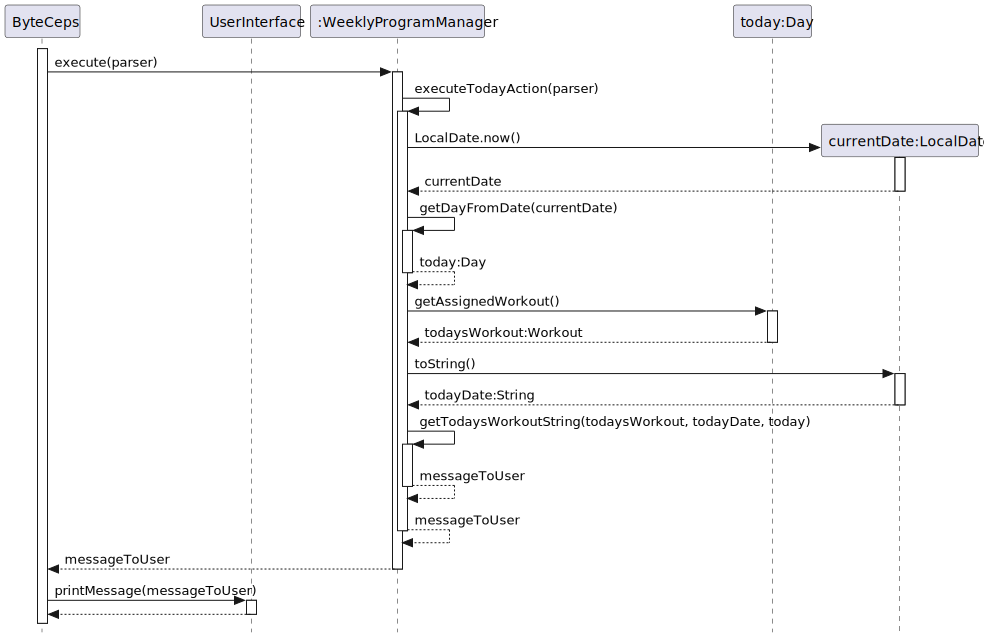\

`storage.save()` sequence diagram:\
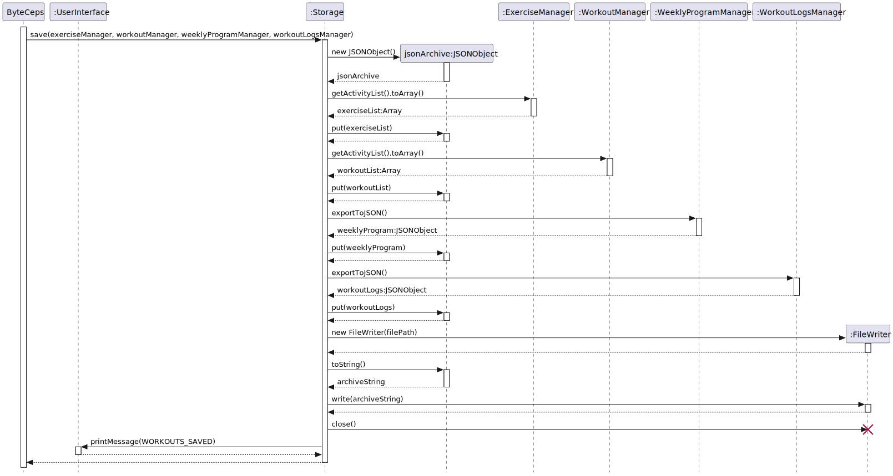
`storage.load()` sequence diagram:\
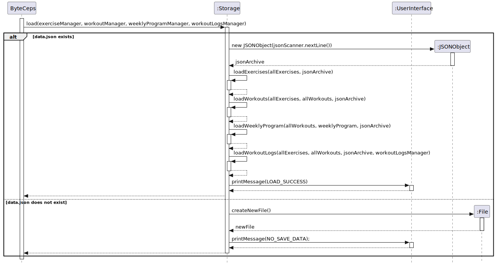

`storage.loadWorkouts()` sequence diagram:\
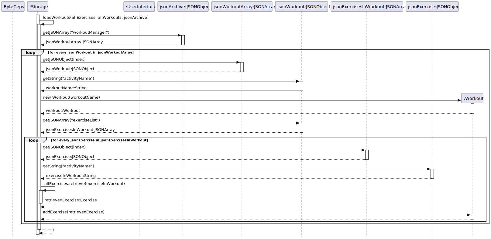
`CascadingDeletionProcessor.removeDeletedExerciseFromWorkouts` sequence diagram:\
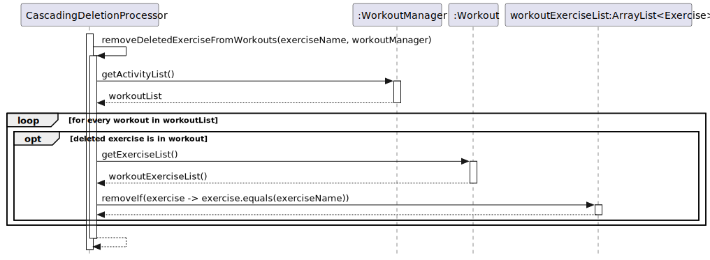
`CascadingDeletionProcessor.removeDeletedWorkoutsFromProgram` sequence diagram:\
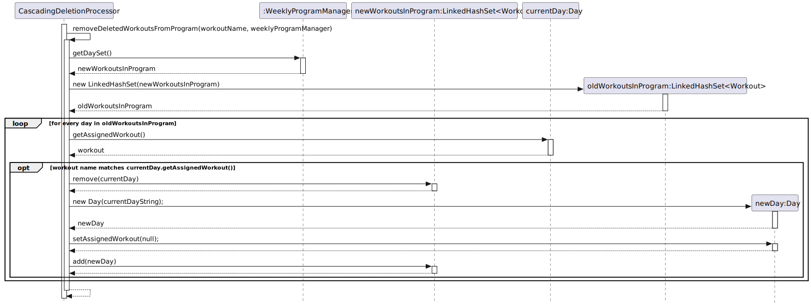